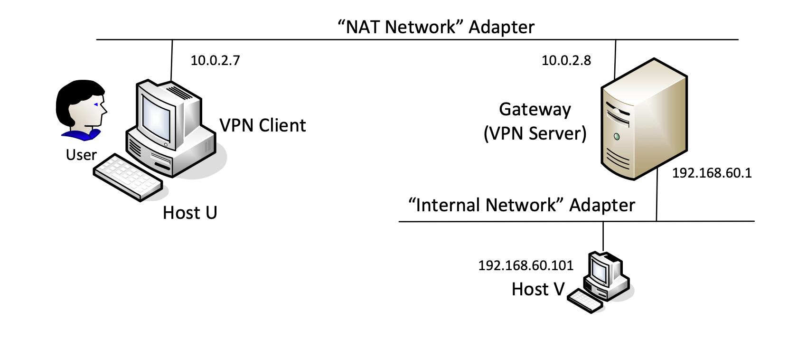
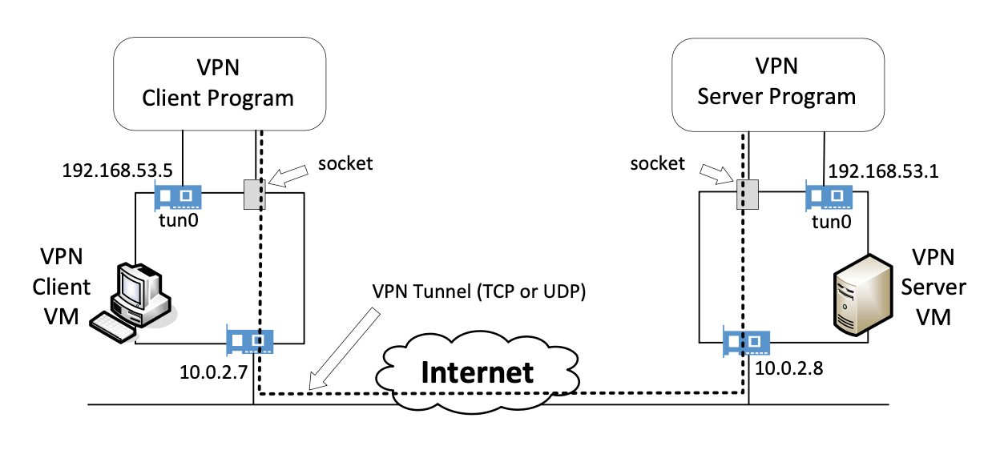

# vpn


This repository implements a VPN in C using OpenSSL and TUN/TAP interfaces. The VPN is implemented using TLS/SSL for secure communication between the client and server. The server is able to handle multiple clients concurrently.

It uses public key cryptography with X.509 certificates for secure key exchange and symmetric encryption keys. The server and client authenticate each other using their certificates. The server also requires clients to provide a username and password for authentication, which is checked against [the Shadow file](https://linux.die.net/man/5/shadow).

The VPN only supports Linux systems.

## How it works

The network setup looks like this when used over a NAT network, although it's not limited to this setup:



The VPN server uses a static IP address which allows clients to connect to a known, fixed hostname. The VPN server and client communicate over a TUN interface, which the VPN server/client programs forward packets to/from. Whenever a packet is received on the TUN interface, the VPN decrypts the data and forwards it to the normal network interface used by the server/client.

This allows users to run programs like `telnet` as normal, but the data is encrypted and sent over the VPN.



## Usage

### Server

First, start the VPN server and setup the TUN interface for it to communicate over:

```bash
$ sudo ./vpnserver
$ sudo ifconfig tun0 192.168.53.1/24 up # Run in another window while the server is running
$ # The following will route packets from the TUN interface to the normal network interface
$ # (if the entry is not already automatically added)
$ sudo route add -net 192.168.53.0/24 eth0
```

Make sure to also permit IPV4 forwarding:

```bash
$ sudo sysctl net.ipv4.ip_forward=1
```

### Client

Now that the server is running, start the VPN client:

```bash
$ sudo ./vpnclient 10.0.2.8 # Replace with the server's IP address
$ sudo ifconfig tun0 192.168.53.5/24 up # Run in another window while the client is running
$ # The following will route packets from the TUN interface to the normal network interface
$ # (if the entry is not already automatically added)
$ sudo route add -net 192.168.53.0/24 eth0
```

Again, make sure to permit IPV4 forwarding:

```bash
$ sudo sysctl net.ipv4.ip_forward=1
```

### Using the TLS/SSL server/client over the VPN

Up to this point, we've only set up a VPN server and client with UDP support. This repository also includes a TLS/SSL server and client that can be used over the VPN.

The TLS/SSL server is implemented in `tlsserver.c` and the client in `tlsclient.c`. The TLS client connects to the TLS server, authenticates itself using the X.509 certificates, and sends a login request to the server. The server checks the username and password against the Shadow file and responds with a success/failure message.

The `login.c` program can be used to check if the server is running and to test the login functionality. The `login` program sends a login request to the server and receives a response.

Once the client is authenticated, the client can send messages to the server over the TLS connection, using protocols like `telnet`. The setup for the TLS server and client is identical to the prior steps, but it also requires the server and client to have the X.509 certificates and keys in the `cert_server/` and `cert_client/` directories respectively.

### Running the servers and clients

All of the programs require root privileges to run, as they need to create TUN interfaces and set up routing tables. The server and client programs can be run as follows:

```bash
$ sudo ./vpnserver
$ sudo ./vpnclient
$ sudo ./tlsserver
$ sudo ./tlsclient
```

## Building

To build the VPN server and client, use the Makefile:

```bash
$ make
```

This will produce the UDP VPN server and client executables (`vpnserver` and `vpnclient`), as well as the TLS/SSL server and client executables (`tlsserver` and `tlsclient`).

## License

This project is licensed under the MIT License. See the [LICENSE](LICENSE) file for more information.